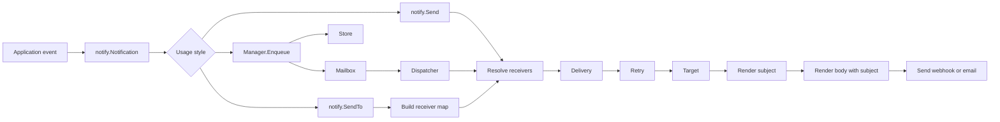

# Notifykit

Notifykit is a small Go toolkit for templated notifications. It handles receiver dispatch, retries, template rendering, and reusable webhook/email targets.

Your application keeps its own config, event types, receiver definitions, and render data. Notifykit only needs a `notify.Notification` implementation.

## Simple example

For simple synchronous delivery, use `notify.SendTo`. It accepts receivers directly, so small programs do not need to build a receiver map.

```go
package main

import (
    "context"
    "log/slog"
    "os"
    "time"

    "github.com/containeroo/notifykit/notify"
    "github.com/containeroo/notifykit/templates"
    "github.com/containeroo/notifykit/targets/webhook"
)

type Alert struct {
    IDValue string
    Service string
    Status  string
}

func (a Alert) ID() string { return a.IDValue }

func (a Alert) Data(receiver string, vars map[string]any, subject string) any {
    return map[string]any{
        "ID":       a.IDValue,
        "Service":  a.Service,
        "Status":   a.Status,
        "Subject":  subject,
        "Receiver": receiver,
        "Vars":     vars,
    }
}

func main() {
    ctx := context.Background()
    logger := slog.New(slog.NewTextHandler(os.Stdout, nil))

    subject, err := templates.ParseStringTemplate("subject", `{{ .Service }} is {{ .Status }}`)
    if err != nil {
        panic(err)
    }

    body, err := templates.ParseTemplate("webhook", `{"text": {{ .Subject | json }}}`)
    if err != nil {
        panic(err)
    }

    target := webhook.New(
        webhook.WithURL("https://example.com/webhook"),
        webhook.WithSubjectTemplate(subject),
        webhook.WithTemplate(body),
        webhook.WithClient(webhook.NewClient(10*time.Second)),
        webhook.WithLogger(logger),
        webhook.WithValidateJSON(),
    )

    receiver := notify.NewReceiver("ops", target).
        WithRetry(notify.RetryConfig{
            Count:   2,
            Backoff: time.Second,
        })

    err = notify.SendTo(ctx, Alert{
        IDValue: "alert-1",
        Service: "api",
        Status:  "down",
    }, receiver)
    if err != nil {
        panic(err)
    }
}
```

Runnable examples are available in:

```text
examples/single/      synchronous send to one receiver
examples/multiple/    synchronous send to multiple receivers
```

Run them with:

```sh
go run ./examples/single
go run ./examples/multiple
```

## Receiver helpers

`notify.NewReceiver` and the fluent receiver methods are convenience helpers for simple setup:

```go
receiver := notify.NewReceiver("ops", slackTarget, emailTarget).
    WithName("Operations").
    WithVars(map[string]any{"channel": "alerts"}).
    WithRetry(notify.RetryConfig{Count: 2, Backoff: time.Second})

err := notify.SendTo(ctx, alert, receiver)
```

Available helpers:

```go
func NewReceiver(id ReceiverID, targets ...Target) *Receiver
func NewReceivers(receivers ...*Receiver) Receivers
func SendTo(ctx context.Context, notification Notification, receivers ...*Receiver) error

func (r *Receiver) WithName(name string) *Receiver
func (r *Receiver) WithVars(vars map[string]any) *Receiver
func (r *Receiver) WithRetry(cfg RetryConfig) *Receiver
func (r *Receiver) WithTargets(targets ...Target) *Receiver
```

`SendTo` is a small wrapper around `Send`: it builds a `Receivers` map from the provided receivers, uses a discard logger for Notifykit internals, resolves routing, and returns after delivery completes.

## Target options

Webhook and email targets use functional options for simple construction.

```go
client := webhook.NewClient(
    10*time.Second,
    webhook.WithProxyFromEnvironment(),
    webhook.WithSkipTLSVerify(),
)

webhookTarget := webhook.New(
    webhook.WithName("slack-alerts"),
    webhook.WithURL("https://example.com/webhook"),
    webhook.WithClient(client),
    webhook.WithSubjectTemplate(subject),
    webhook.WithTemplate(body),
    webhook.WithValidateJSON(),
)

emailTarget := email.New(
    email.WithHost("smtp.example.com"),
    email.WithPort(587),
    email.WithCredentials("user", "pass"),
    email.WithFrom("alerts@example.com"),
    email.WithTo("ops@example.com"),
    email.WithCC("lead@example.com"),
    email.WithBCC("audit@example.com"),
    email.WithSubjectTemplate(subject),
    email.WithTemplate(body),
)
```

## Config-driven usage

For config-driven applications, use a `notify.Receivers` map directly. The map key is the receiver ID used for routing.

```go
receivers := notify.Receivers{
    "ops": {
        Name: "Operations",
        Retry: notify.RetryConfig{
            Count:   2, // two retries, three total attempts
            Backoff: time.Second,
        },
        Vars: map[string]any{
            "channel": "alerts",
        },
        Targets: []notify.Target{
            slackWebhook,
            emailTarget,
        },
    },
}

err := notify.Send(ctx, alert, receivers, logger)
```

## Manager example

For queued asynchronous delivery, use `notify.NewManager`, start it once, and enqueue notifications over time.

```go
manager, err := notify.NewManager(receivers, logger)
if err != nil {
    panic(err)
}
if err := manager.Start(ctx); err != nil {
    panic(err)
}

queueID, err := manager.Enqueue(ctx, alert)
if err != nil {
    panic(err)
}
fmt.Println("queued notification", queueID)
```

## Flow



## Packages

```text
notify/             queue, dispatcher, receivers, retries, and target interfaces
templates/          template loading, parsing, and rendering
targets/webhook/    HTTP webhook target
targets/email/      SMTP email target
```

## Notification contract

Applications implement this interface:

```go
type Notification interface {
    ID() string
    Data(receiver string, vars map[string]any, subject string) any
}
```

`ID` returns a stable notification identifier for logs and delivery tracing.

`Data` returns the template context. Webhook and email targets call it twice: first with an empty subject to render the subject template, then with the rendered subject so the body can use `.Subject`.

To select specific receivers, also implement `notify.ReceiverRouter`:

```go
type ReceiverRouter interface {
    ReceiverIDs() []ReceiverID
}
```

`ReceiverIDs` controls routing. The returned values are matched against the keys in the receiver map passed to `notify.Send`, `notify.SendTo`, or `notify.NewManager`.

```go
func (a Alert) ReceiverIDs() []notify.ReceiverID {
    return []notify.ReceiverID{"ops"}
}
```

Routing behavior:

```text
nil or empty ReceiverIDs()        send to all configured receivers
[]ReceiverID{"ops"}               send to receiver ID "ops"
[]ReceiverID{"ops", "dev"}        send to both receiver IDs
unknown receiver ID               skip that receiver and log a warning
```

For compatibility, notifications that still implement `ReceiverNames() []string` are also supported, but new code should use `ReceiverIDs`.

## Receivers and targets

A receiver groups one or more delivery targets and optional receiver-scoped settings.

```go
receiver := notify.NewReceiver("ops", slackWebhook, emailTarget).
    WithName("Operations").
    WithVars(map[string]any{"channel": "alerts"}).
    WithRetry(notify.RetryConfig{Count: 2, Backoff: time.Second})
```

`Receiver.ID` is the routing identifier. `Receiver.Name` is passed into the notification payload as the receiver name. When `Name` is empty, Notifykit defaults it to the receiver ID.

## Webhook target dependencies

Webhook targets own HTTP-specific dependencies. The manager keeps its own logger for queueing and dispatch logs, while each webhook target may receive a target-specific `Logger` and `Client`.

This keeps `notify.Manager` transport-agnostic and still lets applications provide a custom `*http.Client` for timeouts, transports, proxies, tracing, mTLS, or tests.

```go
client := webhook.NewClient(
    5*time.Second,
    webhook.WithProxyFromEnvironment(),
)
target := webhook.New(
    webhook.WithURL("https://example.com/webhook"),
    webhook.WithSubjectTemplate(subject),
    webhook.WithTemplate(body),
    webhook.WithClient(client),
    webhook.WithLogger(logger),
    webhook.WithValidateJSON(),
)
```

By default, `webhook.NewClient` does not use proxy environment variables. Add `webhook.WithProxyFromEnvironment()` when proxy support should be enabled. Add `webhook.WithSkipTLSVerify()` only for local development or trusted private endpoints with self-signed certificates.

## Email target recipients

Email targets support primary, CC, and BCC recipients.

```go
target := email.New(
    email.WithHost("smtp.example.com"),
    email.WithFrom("alerts@example.com"),
    email.WithTo("ops@example.com"),
    email.WithCC("lead@example.com"),
    email.WithBCC("audit@example.com"),
    email.WithSubjectTemplate(subject),
    email.WithTemplate(body),
)
```

`To` and `CC` are written as message headers. `BCC` recipients are sent as SMTP envelope recipients but are not written to the message headers.

## Templates

Templates use Go `text/template` plus Notifykit's default helper functions. The default helper map includes `json`, `default`, `withPrefix`, `optional`, and `when`, which are enough for the bundled Slack and email examples.

```go
subject, err := templates.ParseStringTemplate("subject", `{{ .Service }} is {{ .Status }}`)
body, err := templates.LoadSource(templateFS, "builtin:slack")
```

Missing map keys fail by default. Use `WithMissingKey` for looser templates:

```go
tmpl, err := templates.ParseStringTemplate(
    "subject",
    `{{ .Service }}`,
    templates.WithMissingKey(templates.MissingKeyDefault),
)
```

Notifykit uses `github.com/containeroo/tmplfuncs` for its default helpers and exposes the full `tmplfuncs.FuncMap()` by default. This includes helpers such as `json`, `default`, `coalesce`, `formatTime`, `trim`, `upper`, `lower`, `withPrefix`, `withSuffix`, `optional`, `when`, and `duration`:

```go
body, err := templates.ParseTemplate(
    "webhook",
    `{"text": {{ print
        "Expected every: " (.ExpectedEvery | duration) "\n"
        "Expected by: " (.ExpectedBy | formatTime "2006-01-02 15:04:05 MST")
        | json
    }}}`,
)
```

Applications can add or override project-specific template functions with `WithFunc` or `WithFuncs`.
This is useful for formatting that should be owned by the application.

```go
func formatDuration(d time.Duration) string {
    if d < 0 {
        d = -d
    }
    if d < time.Second {
        return d.Truncate(time.Millisecond).String()
    }
    return d.Truncate(time.Second).String()
}

funcs := templates.WithFunc("formatDuration", formatDuration)

subject, err := templates.ParseStringTemplate(
    "subject",
    `{{ .Service }} is {{ .Status }}`,
    funcs,
)

body, err := templates.ParseTemplate(
    "webhook",
    `{"text": {{ (.Duration | formatDuration) | json }}}`,
    funcs,
)
```

## Development

Run the full local check suite with:

```sh
make test
```

This runs `go fmt`, `go vet`, and `go test -covermode=atomic` for all non-example packages.

## Application boundary

Keep these parts in your application:

- config parsing
- event types
- render data structs
- built-in template aliases and defaults
- database persistence
- metrics and audit logging

Notifykit owns only the notification mechanics.

## License

This project is licensed under the Apache 2.0 License. See the [LICENSE](LICENSE) file for details.
