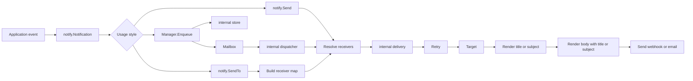

# Notifykit

Notifykit is a small Go toolkit for templated notifications. It handles receiver dispatch, retries, template rendering, and reusable webhook/email targets.

Your application keeps its own config, event types, receiver definitions, and render data. Notifykit only needs a `notify.Notification` implementation.

## Simple example

For simple synchronous delivery, use `notify.SendTo`. It accepts receivers directly, so small programs do not need to build a receiver map.

```go
package main

import (
    "context"
    "log/slog"
    "os"
    "time"

    "github.com/containeroo/notifykit/notify"
    "github.com/containeroo/notifykit/templates"
    "github.com/containeroo/notifykit/targets/webhook"
)

type Alert struct {
    IDValue string
    Service string
    Status  string
}

func (a Alert) ID() string { return a.IDValue }

func (a Alert) Data(receiver string, customData map[string]any, title string) any {
    return map[string]any{
        "ID":       a.IDValue,
        "Service":  a.Service,
        "Status":   a.Status,
        "Title":    title,
        "Receiver": receiver,
        "CustomData": customData,
    }
}

func main() {
    ctx := context.Background()
    logger := slog.New(slog.NewTextHandler(os.Stdout, nil))

    title, err := templates.ParseStringTemplate("title", `{{ .Service }} is {{ .Status }}`)
    if err != nil {
        panic(err)
    }

    body, err := templates.ParseTemplate("webhook", `{"text": {{ .Title | json }}}`, templates.WithDefaultFuncs())
    if err != nil {
        panic(err)
    }

    target := webhook.New(
        webhook.WithURL("https://example.com/webhook"),
        webhook.WithTitleTemplate(title),
        webhook.WithTemplate(body),
        webhook.WithClient(webhook.NewClient(10*time.Second)),
        webhook.WithLogger(logger),
        webhook.WithValidateJSON(),
    )

    receiver := notify.NewReceiver("ops", target).
        WithRetry(notify.RetryConfig{
            Count:   2,
            Backoff: time.Second,
            Policy:  notify.DefaultRetryPolicy,
        })

    err = notify.SendTo(ctx, Alert{
        IDValue: "alert-1",
        Service: "api",
        Status:  "down",
    }, receiver)
    if err != nil {
        panic(err)
    }
}
```

Runnable examples are available in:

```text
examples/single/      synchronous send to one receiver
examples/multiple/    synchronous send to multiple receivers
```

Run them with:

```sh
go run ./examples/single
go run ./examples/multiple
```

## Receiver helpers

`notify.NewReceiver` and the fluent receiver methods are convenience helpers for simple setup:

```go
receiver := notify.NewReceiver("ops", slackTarget, emailTarget).
    WithName("Operations").
    WithCustomData(map[string]any{"channel": "alerts"}).
    WithRetry(notify.RetryConfig{Count: 2, Backoff: time.Second, Policy: notify.DefaultRetryPolicy})

err := notify.SendTo(ctx, alert, receiver)
```

Available helpers:

```go
func NewReceiver(id ReceiverID, targets ...Target) *Receiver
func NewReceivers(receivers ...*Receiver) Receivers
func SendTo(ctx context.Context, notification Notification, receivers ...*Receiver) error

func (r *Receiver) WithName(name string) *Receiver
func (r *Receiver) WithCustomData(customData map[string]any) *Receiver
func (r *Receiver) WithRetry(cfg RetryConfig) *Receiver
func (r *Receiver) WithTargets(targets ...Target) *Receiver
```

`SendTo` is a small wrapper around `Send`: it builds a `Receivers` map from the provided receivers, uses a discard logger for Notifykit internals, resolves routing, and returns after delivery completes.

## Target options

Webhook and email targets use functional options for simple construction.

```go
client := webhook.NewClient(
    10*time.Second,
    webhook.WithProxyFromEnvironment(),
    webhook.WithSkipTLSVerify(),
)

webhookTarget := webhook.New(
    webhook.WithName("slack-alerts"),
    webhook.WithURL("https://example.com/webhook"),
    webhook.WithClient(client),
    webhook.WithTitleTemplate(title),
    webhook.WithTemplate(body),
    webhook.WithValidateJSON(),
)

emailTarget := email.New(
    email.WithHost("smtp.example.com"),
    email.WithPort(587),
    email.WithCredentials("user", "pass"),
    email.WithFrom("alerts@example.com"),
    email.WithTo("ops@example.com"),
    email.WithCC("lead@example.com"),
    email.WithBCC("audit@example.com"),
    email.WithSubjectTemplate(subject),
    email.WithTemplate(body),
)
```

## Config-driven usage

For config-driven applications, use a `notify.Receivers` map directly. The map key is the receiver ID used for routing.

```go
receivers := notify.Receivers{
    "ops": {
        Name: "Operations",
        Retry: notify.RetryConfig{
            Count:   2, // two retries, three total attempts
            Backoff: time.Second,
            Policy:  notify.DefaultRetryPolicy,
        },
        CustomData: map[string]any{
            "channel": "alerts",
        },
        Targets: []notify.Target{
            slackWebhook,
            emailTarget,
        },
    },
}

err := notify.Send(ctx, alert, receivers, logger)
```

### Retry behavior

Retries are explicit and opt-in. `RetryConfig.Policy` decides whether a failed delivery may be retried; when `Policy` is `nil`, Notifykit never retries, even when `Count` is greater than zero. `Count` is the number of retries after the initial attempt, so `Count: 2` allows at most three delivery attempts.

A typical configuration uses Notifykit's built-in transient-failure policy:

```go
receiver.WithRetry(notify.RetryConfig{
    Count:      3,
    Backoff:    time.Second,
    MaxBackoff: 30 * time.Second,
    Jitter:     true,
    Policy:     notify.DefaultRetryPolicy,
})
```

With this configuration, a failed delivery is first evaluated by the policy. If the policy returns `false`, the failure is returned immediately. If it returns `true` and attempts remain, Notifykit waits for the calculated retry delay and tries the target again.

#### Retry configuration

| Option       | Meaning                                                                                                              |
| ------------ | -------------------------------------------------------------------------------------------------------------------- |
| `Count`      | Number of retries after the initial attempt. `0` means one attempt only.                                             |
| `Backoff`    | Delay before the first retry. Later local delays double exponentially. Zero or a negative value retries immediately. |
| `MaxBackoff` | Caps the calculated local exponential backoff. Zero or a negative value means no cap.                                |
| `Jitter`     | Applies full jitter to the local backoff, choosing a delay between zero and the calculated backoff.                  |
| `Policy`     | Function that decides whether a failed delivery is retryable. `nil` disables retries.                                |

#### Built-in policies

Retry policies are small functions with this shape:

```go
type RetryPolicy func(result DeliveryResult, err error) bool
```

Notifykit provides reusable policies that can be used alone or combined:

| Policy                        | Retries when                                                                                                     |
| ----------------------------- | ---------------------------------------------------------------------------------------------------------------- |
| `RetryOnTimeout`              | The error is classified as a transport failure and represents a timeout.                                         |
| `RetryOnNetworkError`         | The error is classified as a non-timeout transport failure.                                                      |
| `RetryOnStatusCode(codes...)` | `DeliveryResult.StatusCode` matches one of the supplied codes.                                                   |
| `RetryOnServerError`          | `DeliveryResult.StatusCode` is between 500 and 599.                                                              |
| `RetryOnError`                | Any non-permanent error is returned by the target. This matches Notifykit's original retry-every-error behavior. |
| `AnyRetryPolicy(...)`         | Any contained policy accepts the failure.                                                                        |

`DefaultRetryPolicy` is itself composed from the smaller policies:

```go
notify.AnyRetryPolicy(
    notify.RetryOnTimeout,
    notify.RetryOnNetworkError,
    notify.RetryOnStatusCode(408),
    notify.RetryOnStatusCode(429),
    notify.RetryOnServerError,
)
```

This means the default policy retries classified transport failures, HTTP-style `408 Request Timeout`, `429 Too Many Requests`, and status codes from `500` through `599`. It does not retry other failures.

To disable retries, leave the policy unset:

```go
receiver.WithRetry(notify.RetryConfig{})
```

To retry only selected status codes:

```go
receiver.WithRetry(notify.RetryConfig{
    Count:   5,
    Backoff: time.Second,
    Policy:  notify.RetryOnStatusCode(409, 425, 429),
})
```

To combine several built-in policies:

```go
receiver.WithRetry(notify.RetryConfig{
    Count:   4,
    Backoff: time.Second,
    Policy: notify.AnyRetryPolicy(
        notify.RetryOnStatusCode(409, 425, 429),
        notify.RetryOnServerError,
        notify.RetryOnTimeout,
        notify.RetryOnNetworkError,
    ),
})
```

A caller can also provide a completely custom policy:

```go
receiver.WithRetry(notify.RetryConfig{
    Count:   3,
    Backoff: time.Second,
    Policy: func(result notify.DeliveryResult, err error) bool {
        if notify.IsPermanent(err) {
            return false
        }
        return result.StatusCode == 409 || result.StatusCode == 429
    },
})
```

#### Error classification

Notifykit separates failure classification from retry policy. Built-in targets classify failures so policies do not have to guess what an arbitrary `error` means:

```text
template / configuration error  -> notify.Permanent(err)
network / timeout / stream error -> notify.Transport(err)
HTTP response                    -> DeliveryResult.StatusCode
```

`notify.IsPermanent` and `notify.IsTransport` expose these classifications to custom policies. All built-in retry policies treat permanent failures as non-retryable. `RetryOnTimeout` and `RetryOnNetworkError` only operate on errors explicitly marked as transport failures, so an unrelated error cannot accidentally be interpreted as a network failure.

Custom targets should use the same classification when they can distinguish failure types. Custom policies may inspect the classifications and are free to define different behavior.

#### Backoff, jitter, and `Retry-After`

Without jitter, local retry delays grow exponentially from `Backoff`. For example, `Backoff: 1s` produces `1s`, `2s`, `4s`, `8s`, and so on until `MaxBackoff` is reached. With `Jitter: true`, each local delay is randomized between zero and that calculated value to reduce synchronized retries across callers.

Targets may also return `DeliveryResult.RetryAfter` to request a minimum delay before the next attempt. The webhook target fills this automatically from the HTTP `Retry-After` response header and supports both delay-seconds and HTTP-date forms. The effective delay is:

```text
max(local backoff after jitter, DeliveryResult.RetryAfter)
```

A target-provided `RetryAfter` value is not capped by `MaxBackoff`, because it represents the receiver's minimum requested wait time. `RetryAfter` affects only the delay; the configured retry policy still decides whether another attempt is allowed.

Notifykit normalizes receiver configuration when receivers enter `Send`, `SendTo`, `NewReceivers`, or `NewManager`:

```text
empty Receiver.ID      defaults to the receiver map key
empty Receiver.Name    defaults to Receiver.ID
nil receiver value     skipped during routing and delivery
```

Normalization is applied to internal receiver copies, so the receiver values passed by the caller are not modified.

## Manager example

For queued asynchronous delivery, use `notify.NewManager`, start it once, and enqueue notifications over time.

```go
manager, err := notify.NewManager(receivers, logger)
if err != nil {
    panic(err)
}
if err := manager.Start(ctx); err != nil {
    panic(err)
}

queueID, err := manager.Enqueue(ctx, alert)
if err != nil {
    panic(err)
}
fmt.Println("queued notification", queueID)
```

Managers use one worker by default. Use `notify.WithWorkers` when queued notifications should be delivered concurrently:

```go
manager, err := notify.NewManager(receivers, logger, notify.WithWorkers(4))
```

When more than one worker is configured, different notifications may call the same target at the same time. Built-in targets are safe for this; custom targets should also be safe for concurrent `Send` calls.

## Flow


```mermaid
flowchart LR
    A[Application event] --> B[notify.Notification]
    B --> C{Usage style}
    C --> D[notify.SendTo]
    C --> E[notify.Send]
    C --> F[Manager.Enqueue]
    F --> G[internal store]
    F --> H[Mailbox]
    H --> I[internal dispatcher]
    D --> J[Build receiver map]
    E --> K[Resolve receivers]
    I --> K
    J --> K
    K --> L[internal delivery]
    L --> M[Retry]
    M --> N[Target]
    N --> O[Render title or subject]
    O --> P[Render body with title or subject]
    P --> Q[Send webhook or email]
```

## Packages

```text
notify/             queue, dispatcher, receivers, retries, and target interfaces
templates/          template loading, parsing, and rendering
targets/webhook/    HTTP webhook target
targets/email/      SMTP email target
```

## Notification contract

Applications implement this interface:

```go
type Notification interface {
    ID() string
    Data(receiver string, customData map[string]any, subject string) any
}
```

`ID` returns a stable notification identifier for logs and delivery tracing.

`Data` returns the template context. Targets call it twice: first with an empty string to render their title or subject template, then with the rendered value so the body template can reuse it. Webhook render data commonly exposes that value as `.Title`; email render data commonly exposes it as `.Subject`.

To select specific receivers, also implement `notify.ReceiverRouter`:

```go
type ReceiverRouter interface {
    ReceiverIDs() []ReceiverID
}
```

`ReceiverIDs` controls routing. The returned values are matched against the keys in the receiver map passed to `notify.Send`, `notify.SendTo`, or `notify.NewManager`.

```go
func (a Alert) ReceiverIDs() []notify.ReceiverID {
    return []notify.ReceiverID{"ops"}
}
```

Routing behavior:

```text
nil or empty ReceiverIDs()        send to all configured receivers
[]ReceiverID{"ops"}               send to receiver ID "ops"
[]ReceiverID{"ops", "dev"}        send to both receiver IDs
unknown receiver ID               skip that receiver and log a warning
```

## Receivers and targets

A receiver groups one or more delivery targets and optional receiver-scoped settings.

```go
receiver := notify.NewReceiver("ops", slackWebhook, emailTarget).
    WithName("Operations").
    WithCustomData(map[string]any{"channel": "alerts"}).
    WithRetry(notify.RetryConfig{Count: 2, Backoff: time.Second, Policy: notify.DefaultRetryPolicy})
```

`Receiver.ID` is the routing identifier. `Receiver.Name` is passed into the notification payload as the receiver name. When `ID` or `Name` is empty, Notifykit fills defaults from the receiver map key on internal copies during normalization.

## Webhook target dependencies

Webhook targets own HTTP-specific dependencies. The manager keeps its own logger for queueing and dispatch logs, while each webhook target may receive a target-specific `Logger` and `Client`.

This keeps `notify.Manager` transport-agnostic and still lets applications provide a custom `*http.Client` for timeouts, transports, proxies, tracing, mTLS, or tests.

```go
client := webhook.NewClient(
    5*time.Second,
    webhook.WithProxyFromEnvironment(),
)
target := webhook.New(
    webhook.WithURL("https://example.com/webhook"),
    webhook.WithTitleTemplate(title),
    webhook.WithTemplate(body),
    webhook.WithClient(client),
    webhook.WithLogger(logger),
    webhook.WithValidateJSON(),
)
```

By default, `webhook.NewClient` does not use proxy environment variables. Add `webhook.WithProxyFromEnvironment()` when proxy support should be enabled. Add `webhook.WithSkipTLSVerify()` only for local development or trusted private endpoints with self-signed certificates.

## Email target recipients

Email targets support primary, CC, and BCC recipients.

```go
target := email.New(
    email.WithHost("smtp.example.com"),
    email.WithFrom("alerts@example.com"),
    email.WithTo("ops@example.com"),
    email.WithCC("lead@example.com"),
    email.WithBCC("audit@example.com"),
    email.WithSubjectTemplate(subject),
    email.WithTemplate(body),
)
```

`To` and `CC` are written as message headers. `BCC` recipients are sent as SMTP envelope recipients but are not written to the message headers.

## Templates

Templates use Go `text/template`. No helper functions are enabled by default; opt in to Notifykit's default helpers with `WithDefaultFuncs`.

```go
subject, err := templates.ParseStringTemplate("subject", `{{ .Service }} is {{ .Status }}`)
body, err := templates.LoadSource(templateFS, "builtin:slack", templates.WithDefaultFuncs())
```

Missing map keys fail by default. Use `WithMissingKey` for looser templates:

```go
tmpl, err := templates.ParseStringTemplate(
    "subject",
    `{{ .Service }}`,
    templates.WithMissingKey(templates.MissingKeyDefault),
)
```

`WithDefaultFuncs` enables the helper map returned by `DefaultFuncs`. Notifykit uses `github.com/containeroo/tmplfuncs` for these helpers, including `json`, `default`, `coalesce`, `formatTime`, `trim`, `upper`, `lower`, `withPrefix`, `withSuffix`, `optional`, `when`, and `duration`:

```go
body, err := templates.ParseTemplate(
    "webhook",
    `{"text": {{ print
        "Expected every: " (.ExpectedEvery | duration) "\n"
        "Expected by: " (.ExpectedBy | formatTime "2006-01-02 15:04:05 MST")
        | json
    }}}`,
    templates.WithDefaultFuncs(),
)
```

Applications can add or override project-specific template functions with `WithFunc` or `WithFuncs`.
This is useful for formatting that should be owned by the application.

```go
func formatDuration(d time.Duration) string {
    if d < 0 {
        d = -d
    }
    if d < time.Second {
        return d.Truncate(time.Millisecond).String()
    }
    return d.Truncate(time.Second).String()
}

body, err := templates.ParseTemplate(
    "webhook",
    `{"text": {{ (.Duration | formatDuration) | json }}}`,
    templates.WithDefaultFuncs(),
    templates.WithFunc("formatDuration", formatDuration),
)
```

For complete control, build a function map yourself and pass only the helpers you want:

```go
funcs := templates.DefaultFuncs()
delete(funcs, "duration")
funcs["formatDuration"] = formatDuration

body, err := templates.ParseTemplate(
    "webhook",
    `{"text": {{ (.Duration | formatDuration) | json }}}`,
    templates.WithFuncs(funcs),
)
```

## Development

Run the full local check suite with:

```sh
make test
```

This runs `go fmt`, `go vet`, and `go test -race -covermode=atomic` for all packages. CI also checks Go 1.24 and the current stable Go version.

## Application boundary

Keep these parts in your application:

- config parsing
- event types
- render data structs
- built-in template aliases and defaults
- database persistence
- metrics and audit logging

Notifykit owns only the notification mechanics.

## License

This project is licensed under the Apache 2.0 License. See the [LICENCE](LICENCE) file for details.

## Delivery safety and ownership

SMTP now requires STARTTLS by default and fails if the relay does not offer it.
Use `email.WithTLSMode(email.TLSImplicit)` for TLS from connection establishment
(default port 465), or `email.WithTLSMode(email.TLSPlaintext)` for an explicitly
trusted plaintext relay. Credentials are rejected in plaintext mode. Certificate
verification remains enabled unless explicitly disabled.

Use HTML templates for email bodies so notification values are escaped for their
HTML context:

```go
body, err := templates.LoadHTMLSource(nil, "examples/email-html.tmpl", templates.WithDefaultFuncs())
// Handle err before constructing the target.
target := email.New(email.WithTemplate(body))
```

`templates.ParseHTMLTemplate` parses inline HTML. Existing text templates remain
supported for compatibility; they do not escape HTML. Template source and custom
functions must be trusted. Pass untrusted data as ordinary strings, not trusted
HTML types. Webhooks continue to use text templates with the `json` helper.

Receiver structs, target slices, and top-level `CustomData` maps are copied when
accepted by Notifykit. `Manager.Receivers()` returns snapshots with those same
copying rules. Nested custom values and target objects are shared and must remain
immutable during delivery. Enqueued notifications must remain immutable until
completion; their `Data` methods and custom targets must support concurrent calls
when used concurrently. `NewFromTarget` copies header maps and email recipient
slices before applying options.

Duplicate routing IDs are delivered once. Receivers with no targets are rejected
by `Send` and `NewManager`. Broadcast receivers are processed in ID order.

Failures returned by `Send` retain receiver and target context:

```go
var failure *notify.DeliveryError
if errors.As(err, &failure) {
    // ReceiverID, TargetType, TargetIndex (zero-based), Attempts, Result, Err
}
```

Multiple failures are joined with `errors.Join`. `errors.Is` still finds underlying
errors. `DeliveryError.Result.Response` may contain secrets; it is not included in
the error string.

## Queue capacity and completion

`notify.WithQueueCapacity(128)` bounds admitted queued notifications, excluding
active deliveries. Producers wait for admission before the manager stores their
notification; callers should use a context deadline to bound that wait. Blocked
caller goroutines still retain their own arguments, so applications should also
bound producer concurrency.

```go
manager, err := notify.NewManager(receivers, logger,
    notify.WithQueueCapacity(128),
    notify.WithWorkers(4),
    notify.WithOnComplete(func(result notify.Completion) {
        // QueueID, NotificationID, Err; nil Err means delivery succeeded.
        // Record metrics or an application-owned delivery outcome here.
    }),
)
```

Completion callbacks run on workers (or the cleanup goroutine for discarded work)
and must be concurrency-safe and return promptly. Do not enqueue into the same manager or wait for its shutdown from a
callback. Completion includes delivery failures and unresolved routing. The queue
is in-memory: callbacks do not make it durable across process crashes.

## Manager shutdown

Use `manager.Shutdown(ctx)` to stop accepting work and wait for accepted
notifications to finish. Keep the context passed to `Start` alive while draining.
If the shutdown deadline expires, active deliveries are canceled and remaining
queued work is discarded. Canceling the `Start` context also aborts delivery.

`manager.Wait(ctx)` waits for workers and completion callbacks to finish without
initiating shutdown. Use it after an aborted or timed-out shutdown if you need to
observe cleanup. Undispatched discarded notifications receive completion outcomes
with `notify.ErrManagerStopped`. Notifications already in delivery report their
delivery result or cancellation error. Enqueue after shutdown returns
`notify.ErrManagerStopped`; a manager cannot restart. Shutdown before Start
releases queued notifications as discarded work.

## SMTP validation, retries, and timeouts

Rendered subjects reject CR and LF. Sender and recipient values must each be a
single bare mailbox such as `ops@example.com`; display-name forms and comma-separated
lists are rejected. Pass multiple recipients as separate `WithTo`/`WithCC`/`WithBCC`
arguments.

Email rendering and configuration errors are permanent. SMTP network failures,
timeouts, and temporary 4xx replies are retryable with `DefaultRetryPolicy`;
permanent 5xx replies and certificate verification failures are not. SMTP reply
codes are kept out of the HTTP-style `DeliveryResult.StatusCode`. Use `errors.As`
on the error for `*textproto.Error` when your application needs the SMTP code.

`email.WithTimeout(30*time.Second)` bounds each complete SMTP attempt, including
the greeting, TLS handshake, authentication, and message transfer. Nonpositive
values use the 30-second default. `WithDialTimeout` separately limits connection
establishment; the earlier caller deadline always wins. Retries have separate
attempt timeouts, so use a caller deadline to bound the entire operation.

Webhook URL and transport errors expose safe error messages while preserving the
original causes for `errors.Is` and `errors.As`. Original errors retrieved through
unwrapping may contain secret URLs and should not be logged directly.
