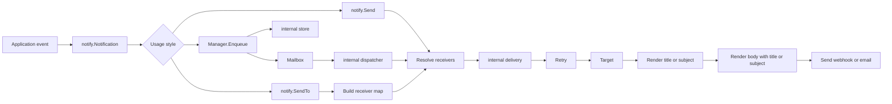

# Notifykit

Notifykit delivers templated notifications through webhooks and SMTP. Start with
`notify.SendTo` for synchronous delivery, or use `notify.Manager` to queue work
and process notifications concurrently.

## Guides

- [Getting started](getting-started.md): installation and a complete webhook example.
- [Receivers and routing](receivers.md): IDs, custom data, and configuration ownership.
- [Retries and errors](retries.md): policies, delays, classification, and structured failures.
- [Queued delivery](manager.md): capacity, workers, completion, and shutdown.
- [Webhooks](webhooks.md): HTTP clients, request configuration, and response handling.
- [Email](email.md): recipients, encryption, validation, and SMTP timeouts.
- [Logging and redaction](logging.md): safe error output and its limits.
- [Templates](templates.md): text, HTML, helper functions, and escaping.
- [Custom targets](custom-targets.md): implementing your own delivery transport.
- [Development](development.md): tests, examples, and the Lore documentation site.

## Packages

| Package           | Responsibility                                             |
| ----------------- | ---------------------------------------------------------- |
| `notify`          | Receivers, routing, delivery, retries, and queue lifecycle |
| `targets/webhook` | HTTP delivery                                              |
| `targets/email`   | SMTP delivery                                              |
| `templates`       | Loading, parsing, and rendering text and HTML              |

See the [Go API reference](https://pkg.go.dev/github.com/containeroo/notifykit)
for exported types and functions. The guides in this repository describe the
current source; published package documentation follows released versions.

## Application boundary

Keep these parts in your application:

- config parsing
- event types
- render data structs
- built-in template aliases and defaults
- database persistence
- metrics and audit logging

Notifykit owns only the notification mechanics. Notification identities are application-owned strings; queued delivery additionally creates a separate Notifykit-owned UUIDv7 queue ID.

## Delivery flow

